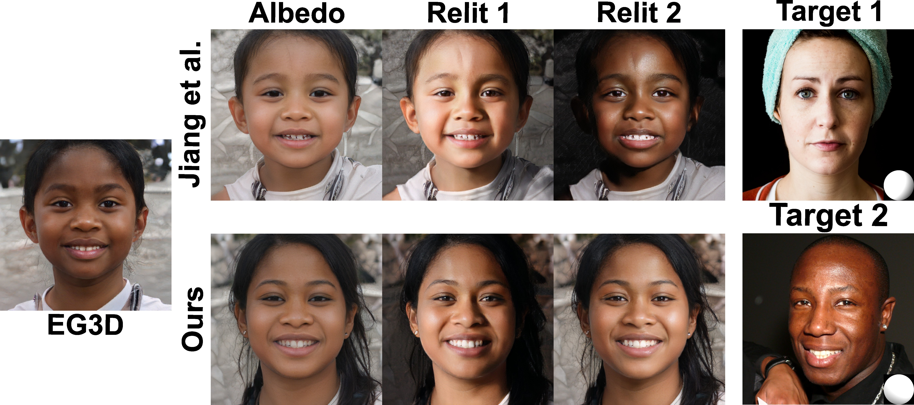

# Analyzing and Improving the Skin Tone Consistency and Bias in Implicit 3D Relightable Face Generators

### [Paper](https://arxiv.org/pdf/2411.12002) | [Project Page](https://libingzeng.github.io/projects/relighting/relighting.html)

This is the official implementation of the paper, titled "Analyzing and Improving the Skin Tone Consistency and Bias in Implicit 3D Relightable Face Generators", which is accepted to WACV 2025.


On the top, we show two relit images produced by NeRFFaceLighting (Jiang et al.), using the lighting extracted from images of individuals with fair and dark skin tones (shown on the right). 
As seen, NeRFFaceLighting produces relit images with inconsistent skin tones. Additionally, when distilling the EG3D triplane, NeRFFaceLighting tends to produce albedo maps that are biased towards lighter skin colors. 
Our method mitigates this bias and improves the consistency of the skin tone in relit images.
Note that even though we use the same latent vector to generate the results with EG3D, NeRFFaceLighting, and ours, there are variation in the images as the backbone EG3D network is finetuned separately in NeRFFaceLighting and ours.

## Abstract
With the advances in generative adversarial networks (GANs) and neural rendering, 3D relightable face generation has received significant attention. Among the existing methods, a particularly successful technique uses an implicit lighting representation and generates relit images through the product of synthesized albedo and light-dependent shading images. While this approach produces high-quality results with intricate shading details, it often has difficulty producing relit images with consistent skin tones, particularly when the lighting condition is extracted from images of individuals with dark skin. Additionally, this technique is biased towards producing albedo images with lighter skin tones. Our main observation is that this problem is rooted in the biased spherical harmonics (SH) coefficients, used during training. Following this observation, we conduct an analysis and demonstrate that the bias appears not only in band 0 (DC term), but also in the other bands of the estimated SH coefficients. We then propose a simple, but effective, strategy to mitigate the problem. Specifically, we normalize the SH coefficients by their DC term to eliminate the inherent magnitude bias, while statistically align the coefficients in the other bands to alleviate the directional bias. We also propose a scaling strategy to match the distribution of illumination magnitude in the generated images with the training data. Through extensive experiments, we demonstrate the effectiveness of our solution in increasing the skin tone consistency and mitigating bias.


## News
- **2024.11.22**: Repo is released.

## TODO List
- [ ] Code Release

## Citation
If our work is useful for your research, please consider citing:
```
@article{Zeng_2025_relighting,
    author = {Zeng, Libing and Kalantari, Nima Khademi},
    title = {Analyzing and Improving the Skin Tone Consistency and Bias in Implicit 3D Relightable Face Generators},
    booktitle={The IEEE/CVF Winter Conference on Applications of Computer Vision},
    year={2025}
}
```
